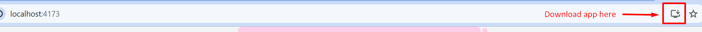

# Contact Search Application

## Introduction

This project aims to create a user-friendly interface for searching through a list of contacts fetched from an API. Utilizing ReactJS and TailwindCSS for the frontend, focus on delivering a smooth user experience with features like real-time search, caching for performance optimization.

## Features

- **Real-Time Search**: Users can search contacts by name or phone number, with results updating as they type.
- **Caching**: Frequently accessed data is cached to improve load times and reduce server requests.
- **Offline Support**: The application (PWA app) can be downloaded and is accessible even without an internet connection.
- **Virtual Scrolling**: Implements an efficient way to display a large list of contacts by only rendering items in the viewport. This technique significantly improves the scrolling performance and user experience, especially on devices with limited resources.
- **Unit Test**: Make sure the app works well by testing parts of it.

## Setup and Installation

1. Clone the repository: git clone https://github.com/munkylo7578/search-app.git
2. Install dependencies: yarn install
3. Run the application: yarn dev
3. Testing the application: yarn test

## Deployed to EC2 Instance

### PWA Download Limitation

App is hosted on an EC2 instance without an SSL certificate so can't use HTTPS for website's address. For a PWA app to be installed and run, it needs to be served over HTTPS.

### Restriction

- **Can't download and install the PWA version of app right now on ec2 instance.**: Without HTTPS, browsers like Chrome, Firefox, and Safari do not allow PWAs to be installed on devices.

### Solution

- **SSL certificate.**: Implemented HTTPS and the PWA functionality will be available.
- **Free SSL**: Using Let's Encrypt for a free SSL certificate requires a specific domain to work. Unfortunately, the EC2 instance domain cannot be used due to policy restrictions so have to purchase a domain.
- **Running on local**: To download the PWA app, follow these steps:

1. yarn build to build the application.
2. yarn preview to start the application in preview mode.
3. Go to http://localhost:4173 and download the app.

Live app here: [http://ec2-34-235-122-231.compute-1.amazonaws.com/](http://ec2-34-235-122-231.compute-1.amazonaws.com/). It's hosted on an AWS EC2 instance and uses Nginx

## Technology Stack

- **Frontend**: ReactJS, TailwindCSS
- **Data Fetching**: Axios, React Query
- **Caching/Optimization**: React Query, Service Workers

## Future Enhancements
- **CI/CD**: Install Jenkins on an EC2 instance to automate code retrieval and building whenever the Git repository changes.
- **Debounce Search**: Implements debounce search when querying data from the server to reduce the number of calls made to the server.
- **Add More Test Cases:**: Introduce additional test cases to cover a wider range of functionalities.

